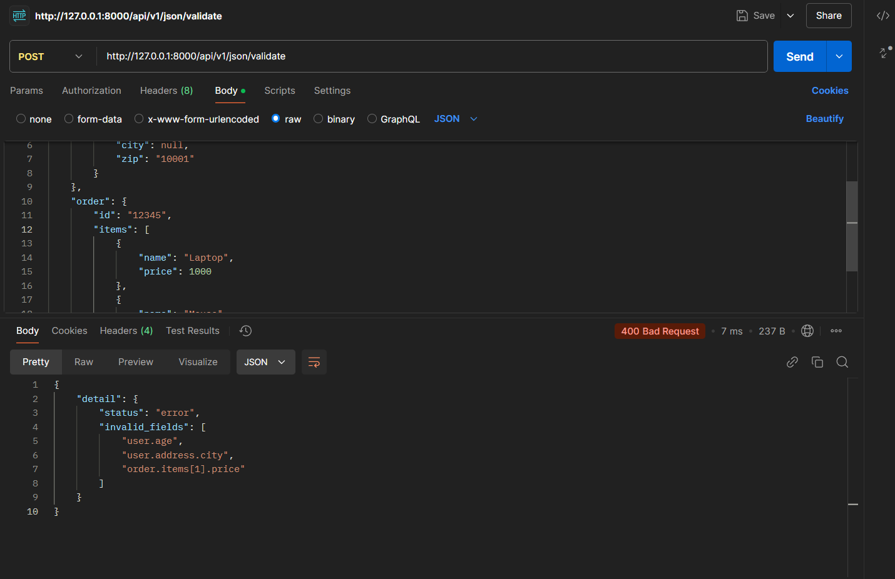
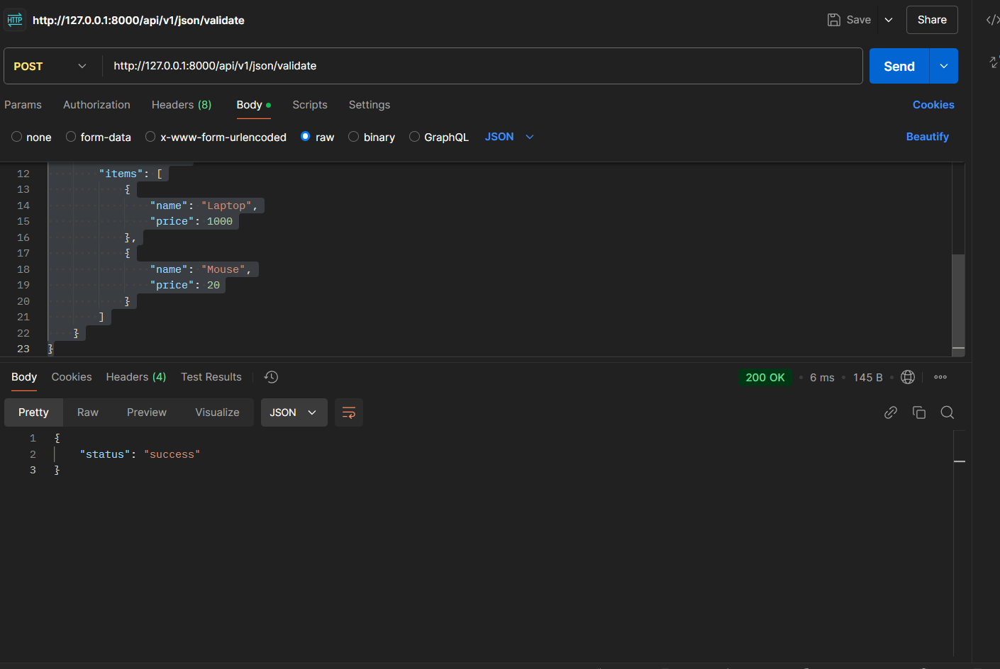

# Universal Validator Service

This is a FastAPI service that validates incoming JSON data to ensure that no field contains a null value. It supports validation of both nested and non-nested fields, and allows dynamic configurations to make null checks optional for specific fields.

## Features

- **Validation of Nested and Non-Nested Fields**: Ensures no `null` values in any part of the JSON structure.
- **Error Reporting**: Returns a detailed list of invalid fields if any field contains a `null` value.
- **Custom Configurations**: Allows optional null checks for specified fields.
- **Response Formats**: Returns a success message if all fields are valid, or an error message with invalid field paths.

## Requirements

- Python 3.8+
- FastAPI
- Uvicorn (for running the development server)
- Pydantic (for request validation)

## Installation

### 1. Clone the repository:

```bash
https://github.com/SonuCodeCrafter/Universal-Validator
cd Universal-Validator
```
### 2. Install the required dependencies:

```bash
pip install -r requirements.txt
```
### 3. Run the FastAPI server:
```bash 
uvicorn main:app --reload
```


## Endpoints

### 1. `POST http://127.0.0.1:8000/api/v1/json/validate`

**Description**:  
Validates the input JSON data to check for any fields that contain `null` values. Returns a success message if all fields are valid, or an error message with the paths of the invalid fields.

#### Request

**URL**:  
`POST http://127.0.0.1:8000/api/v1/json/validate`

**Headers**:
- `Content-Type: application/json`

**Request Body**:

The body should be a JSON object containing two parameters:
- `data`: The JSON data to be validated.
- `optional_fields` (Optional): A list of field paths that should be excluded from null checks.

**Request Example**:

```json
{
        "user": {
            "name": "John Doe",
            "age": 30,
            "address": {
                "city": "New York",
                "zip": "10001"
            }
        },
        "order": {
            "id": "12345",
            "items": [
                { "name": "Laptop", "price": 1000 },
                { "name": "Mouse", "price": 20 }
            ]
        }
}
```
## Example Requests and Responses

### Example 1: Invalid JSON

**Request:**

```json
{
    "data": {
        "user": {
            "name": "John Doe",
            "age": null,
            "address": {
                "city": null,
                "zip": "10001"
            }
        },
        "order": {
            "id": "12345",
            "items": [
                { "name": "Laptop", "price": 1000 },
                { "name": "Mouse", "price": null }
            ]
        }
    }
}

```
**Response:**
```json lines
{
    "status": "error",
    "invalid_fields": [
        "user.age",
        "user.address.city",
        "order.items[1].price"
    ]
}
```




### Example 2: Valid JSON

**Request:**

```json
{
    "data": {
        "user": {
            "name": "John Doe",
            "age": 30,
            "address": {
                "city": "New York",
                "zip": "10001"
            }
        },
        "order": {
            "id": "12345",
            "items": [
                { "name": "Laptop", "price": 1000 },
                { "name": "Mouse", "price": 20 }
            ]
        }
    }
}
```
**Response:**
```json lines
{
    "status": "success"
}
```



### Error Handling
#### 400 Bad Request:
**Returned if the request body is invalid, such as missing required fields or invalid JSON.**